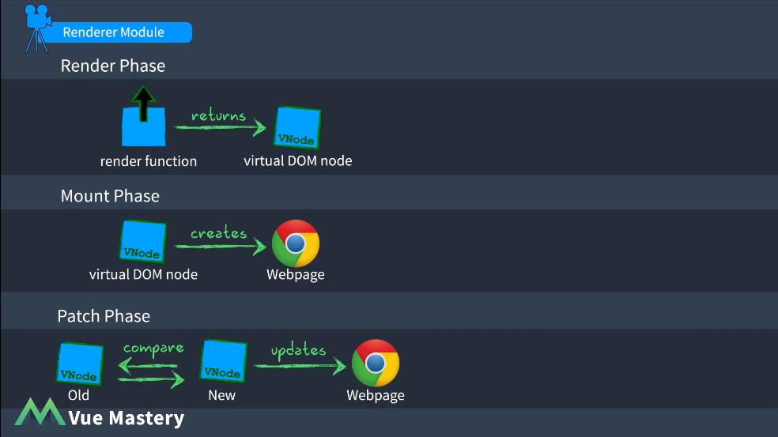

# Vue工作原理

Vue-core包含三大模块

- Reactivity Module 响应式模块
通过Object.defineProperty/Proxy对数据进行劫持，依赖收集以及通知更新。

- Compiler Module 编译模块
对Template 进行 rander 函数
做了三件事：
1. 将组件的 html 模版解析成 AST 对象
2. 优化，遍历 AST，为每个节点做静态标记，标记其是否为静态节点，然后进一步标记出静态根节点，这样在后续更新的过程中就可以跳过这些静态节点了；标记静态根用于生成渲染函数阶段，生成静态根节点的渲染函数
3. 从 AST 生成运行渲染函数，即大家说的 render，其实还有一个，就是 staticRenderFns 数组，里面存放了所有的静态节点的渲染函数

- Renderer Module 模块 
三个阶段：
1. 渲染阶段
调用 render函数 返回 虚拟DOM node（VNode）
2. 挂载阶段
使用虚拟Dom节点调用DOM API来创建 Webpage
3. 补丁阶段（数据更新）
渲染器将新节点和旧节点进行比较更新，并只更新网页变化的部分

## Vue工作流程

1. 编译器将Template转换为一个render函数（render function）
2. 响应式模块初始化响应对象
3. 渲染器调用render函数，它引用了响应对象（数据依赖），通过Watcher可以观察到响应对象的变化，最后（render函数）返回一个虚拟DOM
4. 渲染器在挂载阶段将虚拟DOM节点调用DOM API来创建Webpage
5. 响应对象发生变化，会被Watcher监听，渲染器再次调用render函数，返回一个新的虚拟DOM节点，新旧VNode发送到Patch（补丁函数），更新网页变化的部分。

