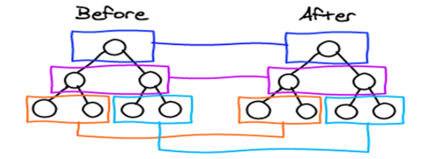
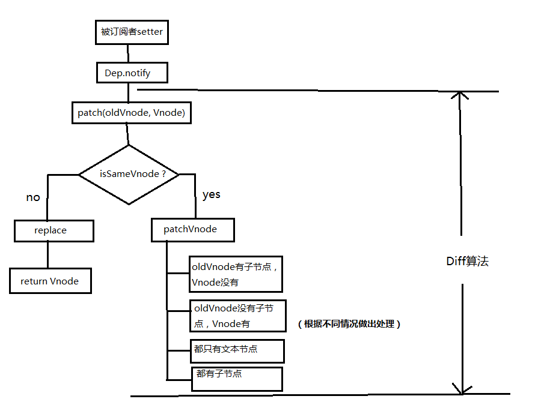
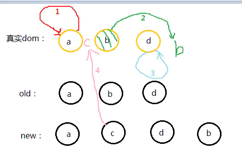
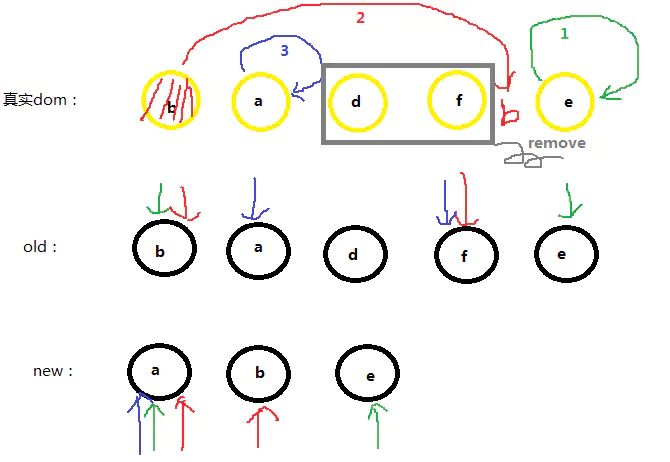
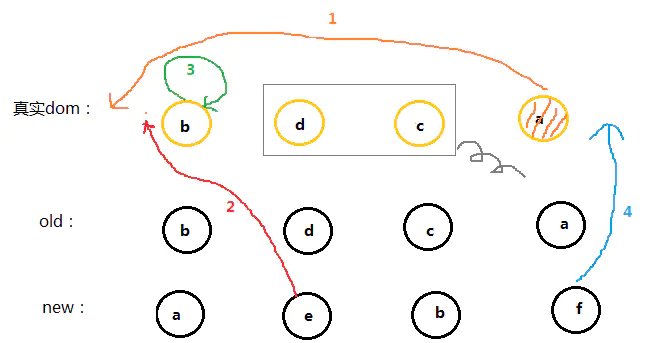

# diff 算法

[详解 vue 的 diff 算法](https://juejin.cn/post/6844903607913938951)

diff 过程整体策略：深度优先，同层比较。



## diff 流程

当数据发生改变时，set 方法会让调用 Dep.notify 通知所有订阅者 Watcher，订阅者就会调用 patch 给真实的 DOM 打补丁，更新相应的视图。



### patch

```js
function patch(oldVnode, vnode) {
  // some code
  if (sameVnode(oldVnode, vnode)) {
    patchVnode(oldVnode, vnode)
  } else {
    const oEl = oldVnode.el // 当前oldVnode对应的真实元素节点
    let parentEle = api.parentNode(oEl) // 父元素
    createEle(vnode) // 根据Vnode生成新元素
    if (parentEle !== null) {
      api.insertBefore(parentEle, vnode.el, api.nextSibling(oEl)) // 将新元素添加进父元素
      api.removeChild(parentEle, oldVnode.el) // 移除以前的旧元素节点
      oldVnode = null
    }
  }
  // some code
  return vnode
}
```

如果两个节点都是一样的，那么就深入检查他们的子节点。如果两个节点不一样那就说明 Vnode 完全被改变了，就可以直接替换 oldVnode。
虽然这两个节点不一样但是他们的子节点一样怎么办？别忘了，diff 可是逐层比较的，如果第一层不一样那么就不会继续深入比较第二层了。（我在想这算是一个缺点吗？相同子节点不能重复利用了...）

### sameNode

```js
function sameVnode(a, b) {
  return (
    a.key === b.key && // key值
    a.tag === b.tag && // 标签名
    a.isComment === b.isComment && // 是否为注释节点
    // 是否都定义了data，data包含一些具体信息，例如onclick , style
    isDef(a.data) === isDef(b.data) &&
    sameInputType(a, b) // 当标签是<input>的时候，type必须相同
  )
}
```

### patchVnode

```js
patchVnode (oldVnode, vnode) {
    const el = vnode.el = oldVnode.el
    let i, oldCh = oldVnode.children, ch = vnode.children
    if (oldVnode === vnode) return
    if (oldVnode.text !== null && vnode.text !== null && oldVnode.text !== vnode.text) {
      api.setTextContent(el, vnode.text)
    }else {
      updateEle(el, vnode, oldVnode)
    if (oldCh && ch && oldCh !== ch) {
          updateChildren(el, oldCh, ch)
    }else if (ch){
          createEle(vnode) //create el's children dom
    }else if (oldCh){
          api.removeChildren(el)
    }
  }
}
```

- 找到对应的真实 dom，称为 el
- 判断 Vnode 和 oldVnode 是否指向同一个对象，如果是，那么直接 return
- 如果他们都有文本节点并且不相等，那么将 el 的文本节点设置为 Vnode 的文本节点。
- 如果 oldVnode 有子节点而 Vnode 没有，则删除 el 的子节点
- 如果 oldVnode 没有子节点而 Vnode 有，则将 Vnode 的子节点真实化之后添加到 el
- 如果两者都有子节点，则执行 updateChildren 函数比较子节点，这一步很重要

### updateChildren

- 将 Vnode 的子节点 Vch 和 oldVnode 的子节点 oldCh 提取出来
- oldCh 和 vCh 各有两个头尾的变量 StartIdx 和 EndIdx，它们的 2 个变量相互比较，一共有 4 种比较方式。如果 4 种比较都没匹配，如果设置了 key，就会用 key 进行比较，在比较的过程中，变量会往中间靠，一旦 StartIdx>EndIdx 表明 oldCh 和 vCh 至少有一个已经遍历完了，就会结束比较。

### 图解 updateChildren



- 第一步

```js
OS = a OE = d
S = a E = b
```

OS 与 S 匹配，真实 dom 位置不变。当前位置 a b d

- 第二步

```js
OS = b OE = d
S = c E = b
```

OS 与 E 匹配，将 b 移动至最后。当前位置 a d b

- 第三步

```js
OS = d OE = d
S = c E = d
```

OE 与 E 匹配，位置不变。当前位置 a d b

- 第四步

遍历结束，说明 oldCh 先遍历完。就将剩余的 vCh 节点根据自己的的 index 插入到真实 dom 中去，此时 dom 位置为：a c d b




## 为什么不要以 index 作为 key？

### 移动元素

```html
<div v-for="(item, index) in [1, 2, 3]" :key="index"></div>
```

`[1, 2, 3] --> [3, 2, 1]`

进行子节点的 diff 过程中，会在 旧首节点和新首节点用 sameNode 对比。 这一步命中逻辑，因为现在新旧两次首部节点 的 key 都是 0 了，
然后把旧的节点中的第一个 vnode 和 新的节点中的第一个 vnode 进行 patchVnode 操作。

Vue 对于组件的 diff 是不关心子组件内部实现的，它只会看你在模板上声明的传递给子组件的一些属性是否有更新。

也就是和 v-for 平级的那部分，回顾一下判断 sameNode 的时候，只会判断 key、 tag、是否有 data 的存在（不关心内部具体的值）、是否是注释节点、是否是相同的 input type，来判断是否可以复用这个节点。
