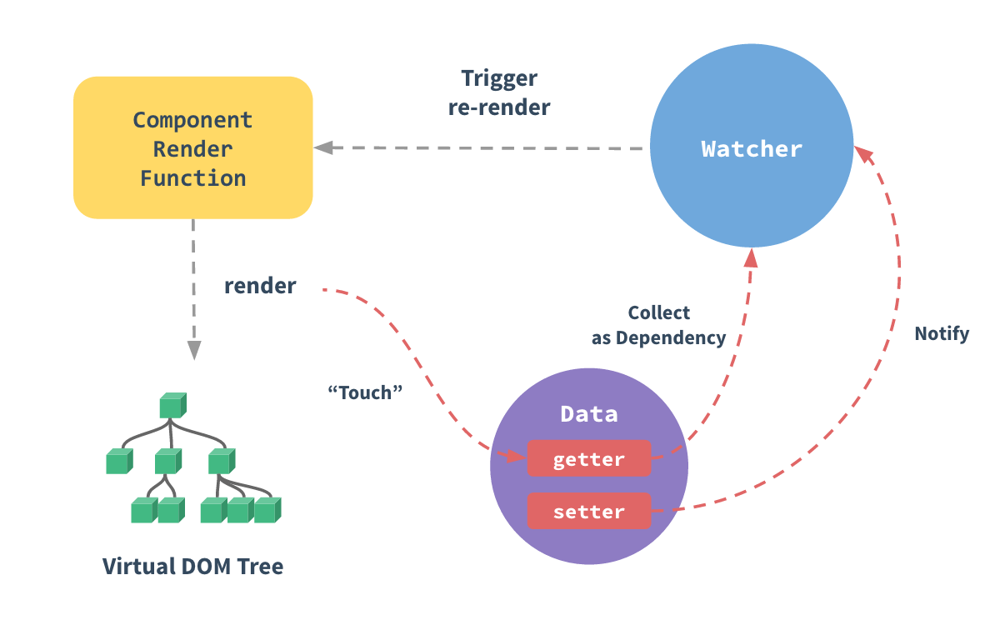
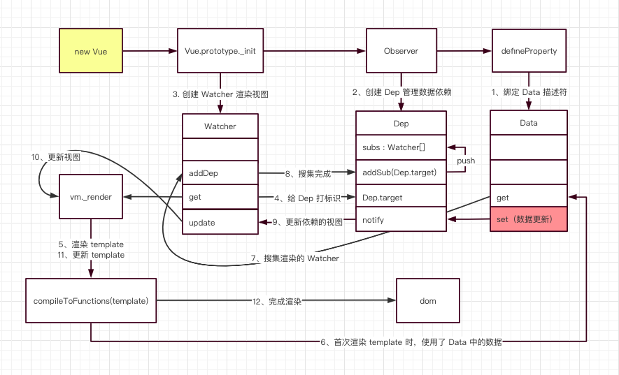

[图解 Vue 响应式原理](https://juejin.cn/post/6857669921166491662)



## 实现响应式



### observe 数据劫持

```js
function observe(data) {
  if (!data || typeof data !== 'object') {
    return
  }
  data.keys.forEach((key) => {
    defineReactive(data, key, data[key])
  })
}
function defineReactive(data, key, val) {
  observe(val)
  // 每个属性创建 Dep
  let dep = new Dep()
  Object.defineProperty(data, key, {
    enumerable: true, // 可枚举
    configurable: true,
    get: function () {
      Dep.target && dep.addDep(Dep.target) // 是否获得观察者，加入依赖搜集
      return val
    },
    set: function (newVal) {
      val = newVal
      dep.notify() // 修改数据时，通知页面重新渲染
    },
  })
}
```

### Dep 依赖搜集

```js
class Dep {
  // subs 存放搜集到的 Watcher 对象集合
  subs: Array<Watcher>
  construtor() {
    this.subs = []
  }
  addDep(sub: Watcher) {
    this.subs.push(sub)
  }
  notify() {
    const subs = this.subs.slice()
    for (let i = 0, l = subs.length; i < l; i++) {
      // 调用对应的 Watcher，更新视图
      subs[i].update()
    }
  }
}
```

### Watcher 观察者

```js
class Watcher {
  constructor(vm: Component, exp: string, fn: Function) {
    // 将 vm._render 方法赋值给 getter。
    this.vm = vm
    this.exp = exp
    this.getter = fn
    this.value = this.get()
  }
  get() {
    Dep.target = this
    let value = this.vm[this.exp]
    Dep.target = null
    return vavlue
  }
  update() {
    const newVal = this.get()
    const oldVal = this.value
    if (newVal !== oldVal) {
      this.value = newVal
      this.getter.call(this.vm, newVal, oldVal)
    }
  }
}
```

### Compile 渲染

```js
class Compile {
  constructor(el, vm) {
    this.vm = vm
    this.$el = this.isElementNode(el) ? el : document.querySelector(el)
    if (this.$el) {
      this.fragment = this.nodeFragment(this.$el)
      this.compileElement(this.fragment)
      this.$el.appendChild(this.fragment)
    }
  }
  nodeFragment() {
    // 因为遍历解析的过程有多次操作dom节点，为提高性能和效率，
    // 会先将跟节点el转换成文档碎片fragment进行解析编译操作，解析完成，再将fragment添加回原来的真实dom节点中
    let fragment = document.createDocumentFragment(),
      child
    while ((child = el.firstChild)) {
      fragment.appendChild(child)
    }
    return fragment
  }
  // 解析el中可操作dom
  compileElement(el) {
    // 有绑定数据的进行new Watcher
  }
}
```

### proxy vs Object.defineProperty

- 无法监听数组变化。
- 只能劫持对象的属性,因此我们需要对每个对象的每个属性进行遍历，如果属性值也是对象那么需要深度遍历,显然能劫持一个完整的对象是更好的选择。
- proxy 性能更好
- proxy 兼容性问题不好
- 除了 get 和 set 之外，proxy 可以拦截多达 13 种操作，比如 has(target, propKey)，可以拦截 propKey in proxy 的操作，返回一个布尔值。
