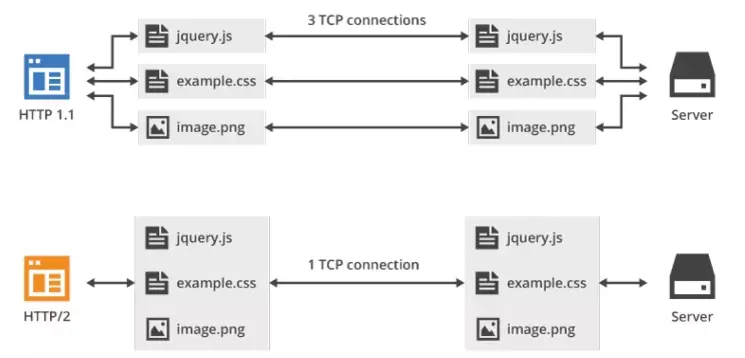
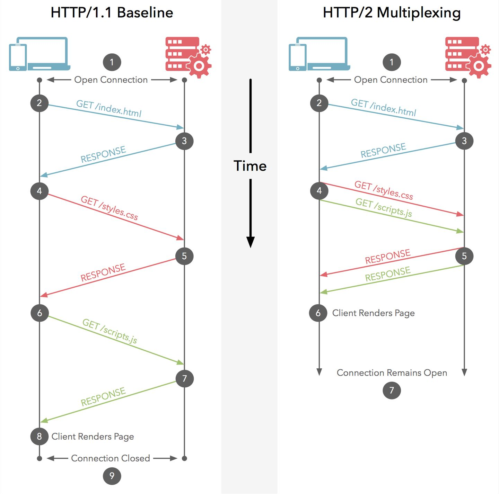

# http

[HTTP/2 对比 HTTP/1.1，特性是什么？是如何解决队头阻塞与压缩头部的？](https://github.com/Advanced-Frontend/Daily-Interview-Question/issues/490)

## http/1.1

问题：

1. 高延迟：页面访问速度下降

HTTP/1.1 版引入了管道机制（pipelining），即在同一个 TCP 连接里面，客户端可以同时发送多个请求，进一步改进了 HTTP 协议的效率.
但这要求服务端必须按照请求发送的顺序返回响应，当顺序请求多个文件时，其中一个请求因为某种原因被阻塞时，在后面排队的所有请求也一并被阻塞，这就是队头阻塞 (Head-Of-Line Blocking)

- **使用多个域名**：将同一个页面的资源分散到不同域名，提升并发连接上限，因为浏览器通常对同一域名的 HTTP 连接最大只能是 6
- **雪碧图**: 将多张小图合并成一张大图供浏览器 JavaScript 来切割使用，这样可以将多个请求合并成一个请求，但是带来了新的问题，当某张小图片更新了，那么需要重新请求大图片，浪费了大量的网络带宽
- **将小图内联**: 将图片的二进制数据通过 base64 编码后，把编码数据嵌入到 HTML 或 CSS 文件中，以此来减少网络请求次数；
- **使用 webpack 等工具打包**: 打包压缩多个 JavaScript 文件到一个文件中，以一个请求替代了很多个请求，但是带来的问题，当某个 js 文件变化了，需要重新请求同一个包里的所有 js 文件；
- **按需加载** ：来减少第一时间的 HTTP 请求次数

2. 明文传输：不安全

HTTP/1.1 在传输数据时，所有传输的内容都是明文，客户端和服务器端都无法验证对方的身份，这在一定程度上无法保证数据的安全性。

3. 无状态：头部巨大切重复

由于 HTTP 协议是无状态的，每一个请求都得携带 HTTP 头部，特别是对于有携带 cookie 的头部，而 cookie 的大小通常很大，另外还有 User Agent、Accept、Server 等，通常多达几百字节甚至上千字节，但 Body 却经常只有几十字节

4. 不支持服务器推送

HTTP/1.1 不支持服务器推送消息，因此当客户端需要获取通知时，只能通过定时器不断地拉取消息，这无疑浪费大量了带宽和服务器资源。

## http/2

HTTP/2 基于 SPDY，专注于性能，最大的目标是在用户和网站间只用一个连接

1. 二进制传输

在应用层(HTTP/2)和传输层(TCP or UDP)之间增加一个二进制分帧层。

在二进制分帧层中， HTTP/2 会将所有传输的信息分割为更小的消息和帧（frame），并对它们采用二进制格式的编码，其中 HTTP1.x 的首部信息会被封装到 HEADERS 帧，而相应的 Request Body 则封装到 DATA 帧里面，HTTP/2 数据分帧后，“Header+Body"的报文结构就完全消失了，协议看到的只是一个个"碎片”。

2. Header 压缩（HPACK）

HTTP/2 对这一点做了优化，引入了头信息压缩机制（header compression）。一方面，头信息使用 gzip 或 compress 压缩后再发送；另一方面，客户端和服务器同时维护一张头信息表，所有字段都会存入这个表，生成一个索引号，以后就不发送同样字段了，只发送索引号，这样就提高速度了。

3. 多路复用

多路复用，就是在一个 TCP 连接中可以存在多条流。换句话说，也就是可以发送多个请求，对端可以通过帧中的标识知道属于哪个请求。

多路复用很好地解决了浏览器限制同一个域名下请求数量的问题，同时也更容易实现全速传输，毕竟新开一个 TCP 连接都需要慢慢提升传输速度。

- **多工**： HTTP/2 复用 TCP 连接，在一个连接里，客户端和浏览器都可以同时发送多个请求或回应，而且不用按照顺序一一对应，这样就避免了"队头堵塞"

- **数据流**：HTTP/2 并行交错地发送多个请求 / 响应，请求 / 响应之间互不影响

因此，必须要对数据包做标记，指出它属于哪个请求 / 响应。

HTTP/2 将每个请求或回应的所有数据包，称为一个数据流（stream）。每个数据流都有一个独一无二的编号。数据包发送的时候，都必须标记数据流 ID，用来区分它属于哪个数据流。另外还规定，客户端发出的数据流，ID 一律为奇数，服务器发出的，ID 为偶数。

数据流发送到一半的时候，客户端和服务器都可以发送信号（RST_STREAM 帧），取消这个数据流。1.1 版取消数据流的唯一方法，就是关闭 TCP 连接。这就是说，HTTP/2 可以取消某一次请求，同时保证 TCP 连接还打开着，可以被其他请求使用。

- **优先级**: 在 HTTP/2 中，每个请求都可以带一个 31bit 的优先值，0 表示最高优先级， 数值越大优先级越低。有了这个优先值，客户端和服务器就可以在处理不同的流时采取不同的策略，以最优的方式发送流、消息和帧。

4. 服务端 Push

HTTP/2 允许服务器未经请求，主动向客户端发送资源，这叫做服务器推送（server push）。

常见场景是客户端请求一个网页，这个网页里面包含很多静态资源。正常情况下，客户端必须收到网页后，解析 HTML 源码，发现有静态资源，再发出静态资源请求。其实，服务器可以预期到客户端请求网页后，很可能会再请求静态资源，所以就主动把这些静态资源随着网页一起发给客户端了。

这样就可以相对减少一点延迟时间。当然在浏览器兼容的情况下你也可以使用 prefetch 。

### keep-alive vs 多路复用

http/0 短连接 一次请求响应都要进行一次 tcp 三次握手和四次挥手。

TCP 连接的新建成本很高，因为客户端和服务器建立连接时需要“三次握手”，发送 3 个数据包，需要 1 个 RTT；关闭连接是“四次挥手”，4 个数据包需要 2 个 RTT，并且开始时发送速率较慢（slow start），随着网页加载的外部资源越来越多，这个问题就愈发突出了

http/1 长连接 设置 Connection: keep-alive;http/1.1 默认开启。

在 HTTP 请求建立 TCP 连接时，请求结束，TCP 连接不断开，继续保持一段时间（timeout），在这段时间内，同一客户端向服务器发送请求都会复用该 TCP 连接，并重置 timeout 时间计数器，在接下来 timeout 时间内还可以继续复用 TCP 。这样无疑省略了反复创建和销毁 TCP 连接的损耗。

HTTP/2 多路复用

- HTTP/1.x 虽然引入了 keep-alive 长连接，但它每次请求必须等待上一次响应之后才能发起，
- 所以，在 HTTP/1.1 中提出了管道机制（默认不开启），下一次的请求不需要等待上一个响应来之后再发送，但这要求服务端必须按照请求发送的顺序返回响应，当顺序请求多个文件时，其中一个请求因为某种原因被阻塞时，在后面排队的所有请求也一并被阻塞，这就是队头阻塞 (Head-Of-Line Blocking)
- 人们采取了很多方法去解决，例如使用多个域名、引入雪碧图、将小图内联等，但都没有从根本上解决问题

如何实现：

- 首先它引入了 帧（frame）和流（stream），因为 HTTP/1.x 是基于文本的，因为是文本，就导致了它必须是个整体，在传输是不可切割的，只能整体去传
- 既然，HTTP/2 是基于二进制流的，它就可以把 HTTP 消息分解为独立的帧，交错发送，然后在另一端通过帧中的标识重新组装，这就是多路复用
- 这就实现了在同一个 TCP 连接中，同一时刻可以发送多个请求和响应，且不用按照顺序一一对应，即使某个请求任务耗时严重，也不会影响到其它连接的正常执行
