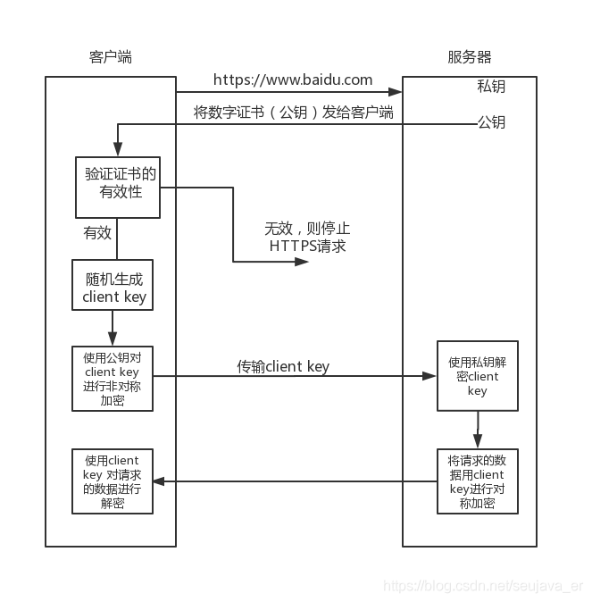

# HTTPS

## HTTP vs HTTPS

- 传输方式不通：http 是明文传输，https 通过 SSL\TLS 进行了加密
- 端口号不同：http 是 80，https 是 443
- https 需要 CA 机构的证书

## https 流程

1. 客户端向服务端发起 https 请求，连接到服务器的 443 端口。
2. 服务端将非对称加密的公钥以证书的形式给到客户端。
3. 客户端收到证书后对证书进行校验（证书是否过期，证书信息是否与服务端信息一致，防止中间人掉包）。如果验证失败，则 https 请求终止。如果验证成功，客户端将生成一个随机私钥（client key），并用证书的公钥对其非对称加密。（第一次 http 请求）
4. 进行第二次 http 请求，客户端将加密后的 client key 传给服务端。
5. 服务端使用私钥进行解密，得到 client key，并用 client key 对数据进行对称加密。
6. 客户端使用 client key 对请求数据进行解密。完成第二次 HTTP 请求。

## 对称加密

密钥加密，密钥解密
优点：速度快
确定：安全性不高，密钥被拦截会遭到中间人攻击。

## 非对称加密

公钥加密，私钥解密

优点：安全性高些，但是还会存在中间人攻击，因为没法保证公钥是服务端的，可能被中间人调包，所以要用到安全证书来验证。
缺点：速度慢

## 对称 + 非对称

使用非对称加密解密 对称密钥，之后久试用这个对称密钥来通信。

## 中间人攻击

1. 服务端公钥给到客户端前，被中间人拦截，中间人将服务端公钥保存，并将自己的公钥给到客户端。
2. 客户端在毫不知情的情况下拿到中间人的公钥，并将数据用它加密。（没有证书，无法判断公钥是谁的）
3. 中间人拿到客户端加密数据，用自己的私钥解密能拿到客户端的数据，而且还能篡改并用服务端的公钥加密给服务端。
4. 服务端拿到中间人篡改的数据解密，毫不知情。

## 数字证书

证书是由 CA 机构颁布给服务端的，里面包含服务端相关信息，公钥等以及数字签名。

1. 先将服务端相关信息，公钥通过 hash 算法生成信息摘要。
2. 将信息摘要通过 CA 私钥加密生成数字签名。
3. 服务端相关信息，公钥与数字签名组合成数字证书。

验证：

1. 客户端拿到数字证书，先将服务端相关信息，公钥通过 hash 算法得到信息摘要。
2. 再将数字签名用 CA 公钥解密得到信息摘要。
3. 通过比较两者信息摘要是否一致来验证证书的合法性。
