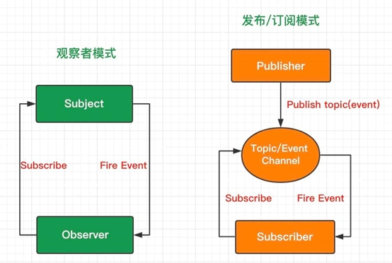

# 设计模式



## 区别

1. 在观察者模式中，观察者知道主题，主题也维护观察者的记录。而在发布订阅模式中，发布者和订阅者不需要彼此了解。他们只是在消息队列或代理的帮助下进行通信。
2. 观察者模式，是松散耦合的，发布订阅模式相反，完全不耦合。
3. 观察者模式主要以同步方式实现，当某个事件发生时，主题调用所有观察者的方法，发布订阅模式大多是异步模式(使用消息队列)
4. 观察者模式基本用于单个应用内部，发布订阅模式更多的是跨应用的模式。

## 观察者模式

观察者模式指的是一个对象（Subject）维持一系列依赖于它的对象（Observer），当有关状态发生变更时 Subject 对象则通知一系列 Observer 对象进行更新。

```js
class Subject {
  constructor() {
    this.observers = []
  }
  add(ob) {
    this.observers.push(ob)
  }
  notify() {
    let observers = this.observers
    for (let i = 0; i < observers.length; i++) {
      observers[i].update()
    }
  }
  remove(ob) {
    let observers = this.observers
    for (let i = 0; i < observers.length; i++) {
      if (observers[i] === ob) {
        this.observers.splice(i, 1)
      }
    }
  }
}

class Observer {
  constructor(name) {
    this.name = name
  }
  update() {
    console.log('my name is ' + this.name)
  }
}

let sub = new Subject()

let ob1 = new Observer('ob1')
let ob2 = new Observer('ob2')

sub.add(ob1)
sub.add(ob2)

sub.notify()
```

## 发布订阅模式

订阅者把自己想要订阅的事件注册到调度中心，当发布者发布事件到调度中心（就是该事件被触发），再由调度中心统一调度订阅者注册到调度中心的处理代码。

```js
class eventEmitter {
  constructor() {
    this._events = {}
  }
  $on(event, listener) {
    let listeners = (this._events[event] = this._events[event] || [])
    listeners.push(listener)
  }
  $emit(event, ...args) {
    let listeners = (this._events[event] = this._events[event] || [])
    for (let i = 0; i < listeners.length; i++) {
      listeners[i](...args)
    }
  }
  $off(event, listener) {
    let listeners = (this._events[event] = this._events[event] || [])
    let index = this.indexOf(listeners, listener)
    if (index !== -1) listeners.splice(index, 1)
  }
}

let emitter = new eventEmitter()
let handler = function (a) {
  console.log(a)
}
emitter.$on('demo', handler)
emitter.$emit('demo', 'demo')
emitter.$off('demo', handler)
```
